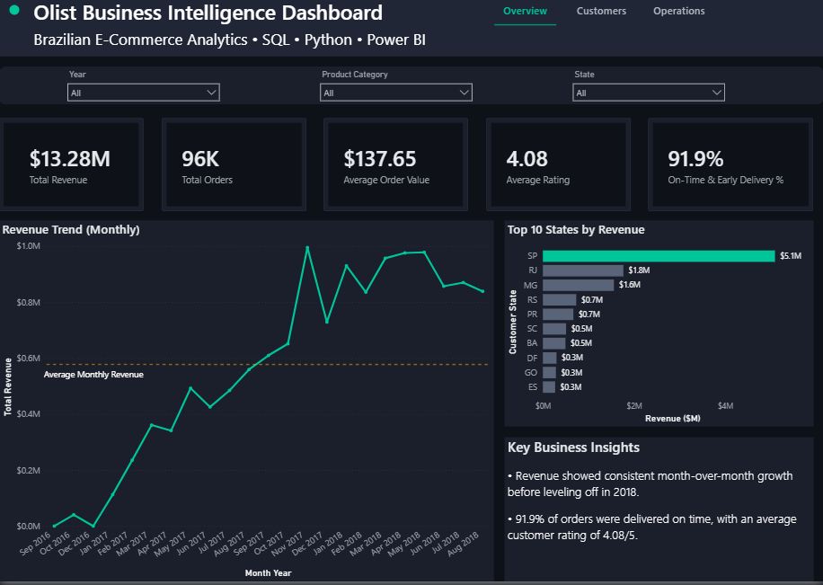
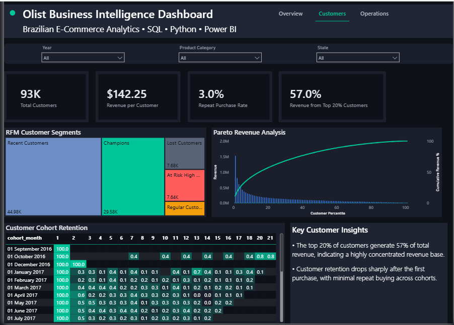
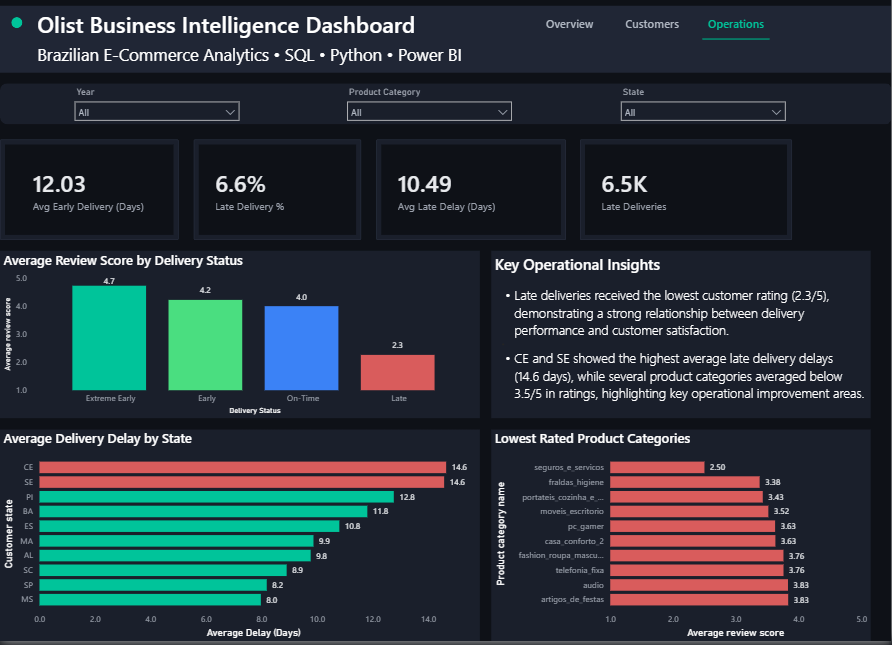

# 🛍️ Brazilian E-Commerce Business Intelligence Dashboard

An end-to-end Business Intelligence project built using **SQLite, Python, Power BI, DAX, and Excel** to analyze the Brazilian Olist E-Commerce dataset.

The project focuses on business performance, customer behavior, and operational efficiency through interactive dashboards and advanced analytics.

---

# 📌 Project Overview

This project transforms raw e-commerce data into actionable business insights by combining SQL, Python, and Power BI.

The dashboard is designed for business stakeholders to monitor company performance, understand customer behavior, and identify operational bottlenecks.


# 🛠️ Tools & Technologies

- SQLite
- Python (Pandas)
- Power BI
- DAX
- Excel

---

# 📊 Dashboard Overview

## Page 1 – Business Overview

Provides an executive summary of overall business performance.

**Key Metrics**
- Total Revenue
- Total Orders
- Average Order Value
- On-Time & Early Delivery %

**Visuals**
- Monthly Revenue Trend
- Top 10 States by Revenue
- Executive Business Insights


## Page 2 – Customer Analytics

Analyzes customer purchasing behavior and long-term value.

**Key Metrics**
- Total Customers
- Revenue per Customer
- Repeat Purchase Rate
- Top 20% Revenue Share

**Visuals**
- RFM Customer Segmentation
- Pareto (80/20) Analysis
- Customer Cohort Retention
- Customer Insights


## Page 3 – Operations Dashboard

Evaluates logistics performance and customer satisfaction.

**Key Metrics**
- Average Early Delivery
- Late Delivery %
- Average Delay (Late Orders)
- Late Deliveries

**Visuals**
- Average Review Score by Delivery Status
- Lowest Rated Product Categories
- Average Delivery Delay by State
- Operational Insights


# 📈 Key Business Insights

- The top 20% of customers generate 57% of total revenue.
- Customer retention declines significantly after the first purchase.
- Late deliveries receive substantially lower customer ratings.
- Certain states experience longer delivery delays, highlighting potential logistics bottlenecks.
- Several product categories consistently receive lower customer ratings, indicating opportunities for operational improvement.

---

# 📂 Repository Structure

```
olist-ecommerce-business-intelligence-dashboard
│
├── Dashboard
│   └── Olist_BI_Dashboard.pbix
│
├── Dataset
│   └── master_olist.csv
│
├── SQL
│   ├── 01_data_cleaning.sql
│   ├── 02_customer_analysis.sql
│   └── 03_operational_analysis.sql
│
├── Python
│   └── customer_analytics.ipynb
│
├── Images
│   ├── overview.png
│   ├── customers.png
│   └── operations.png
│
└── README.md
```

---

# 📸 Dashboard Preview

## Business Overview



---

## Customer Analytics



---

## Operations Dashboard



---

# 💡 Skills Demonstrated

- Data Cleaning
- SQL Querying
- Data Validation
- RFM Customer Segmentation
- Pareto (80/20) Analysis
- Cohort Retention Analysis
- DAX Measures
- Interactive Dashboard Development
- Business Storytelling
- Data Visualization

---

# 📄 Dataset

The project uses the publicly available **Brazilian Olist E-Commerce Dataset**, containing information on customers, orders, products, payments, reviews, and deliveries.

---

# 🚀 Future Improvements

- Forecast future sales using time-series analysis.
- Build customer lifetime value (CLV) prediction models.
- Integrate live database connections.
- Add drill-through pages and advanced report tooltips.
